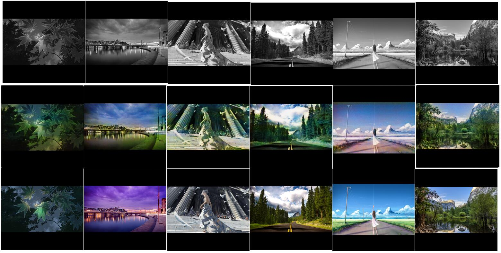

# 使用说明

下面是针对使用时的简单说明。

## 图片格式

将图片放入inputs和outputs文件夹内。需要注意这几点：

1. 文件保存为png格式，文件名以数字表示，例如1.png、2.png、3.png等等；
2. 图片统一到256x256像素；
3. 训练模型的话inputs和outputs文件夹内的图片需要存在对应关系。

## 创建模型

如果是第一次使用，那么模型文件需要先被创建。执行这个文件，创建模型文件：

    python create.py

## 训练和使用模型

存在模型文件的时候有两个文件可以被执行：

1. 使用inputs和outputs内的文件训练模型：

        python train.py --batch=10 --bcount=1 --count=100

    *batch是一次载入内存的图片数量，bcount是载入内存的图片训练次数，count是所有图片的训练次数，所有图片数量取决于inputs文件夹内图片数量。另外，在载入内存的图片完成训练时，会将训练后的模型进行保存，保存时不要中断脚本，也不要修改模型文件以免数据写入失败*

    > 每次运行脚本时都会以随机顺序形成图片列表，所以不需要担心在中间中断后导致下次训练时又从开头训练。

2. 使用模型转换predict/src内的文件到predict/dst文件夹：

        python predict.py --inputs=predict/src --outputs=predict/dst

模型能处理的文件格式是固定的，参照**图片格式**的说明。受训练用的图片质量和数量影响，模型预测的结果可能不一样。受模型初始化参数和噪声输入的随机性影响，同样的数据训练出来的模型也存在一定程度的差异。

## 用来做自动上色的效果

第一行是输入图片，第二行是算法学习后自动上色的，最后一行是原始图片。



## 其他可用的参数

### ```--disable-discriminator```

这个参数可以禁止训练 GAN 中的 discriminator 。

### ```--test```

带有 ```--test``` 参数，可以使用 ```test``` 文件夹内的文件作为测试集计算出损失值。

### ```--save[=log]```

保存训练过程中的参数变化和模型到 log 文件夹内（可以结合 ```--test``` 参数用）。就比如下面，其中参数顺序没有先后。

    python train.py --batch=6 --bcount=2 --count=500 --test --disable-discriminator --save

也可以指定另一个目录保存

    python train.py --batch=6 --bcount=2 --count=500 --test --disable-discriminator --save=F:\log

## 一些可能有用的脚本：

1. imagesFormatTool.py 这个是将根目录 src 文件夹内的所有图片（任何尺寸）转换为所需的尺寸并保存到 inputs 和 outputs 文件夹内，以备训练。这个工具会自动去除彩色信息。
2. imagesFormatTool-msk.py 这个工具与 imagesFormatTool.py 差不多，但是这个用来制造低分辨率图片。
3. createTestSet.py 从 inputs 和 outputs 中取出一部分图片放入 test 文件夹作为测试集用。

> 脚本会删除 inputs, outputs 和根目录的 test 相关的文件夹里的图片。如果需要请先备份好文件。建议不要将重要的文件放在代码文件夹里面。
